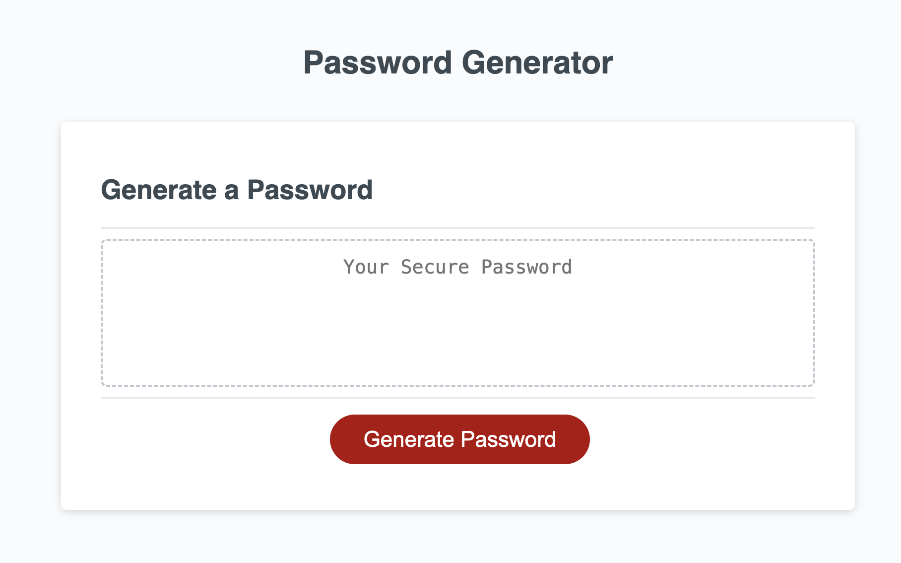
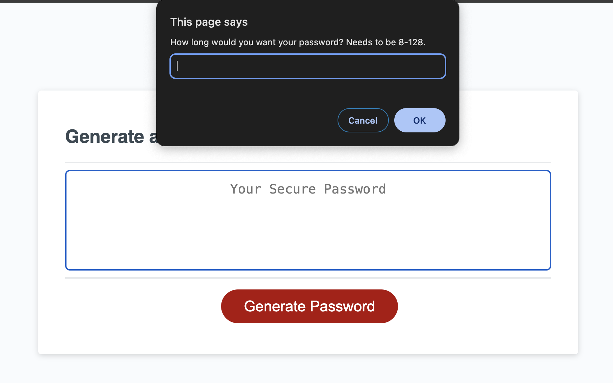
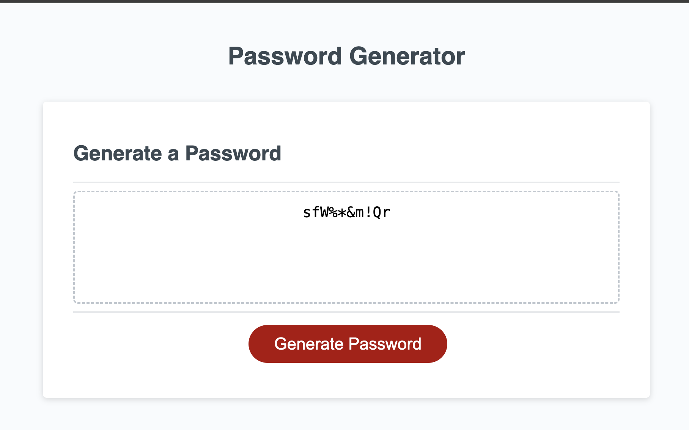

# mod-3-challenge
Module 3 challenge (please see comments below)

This is the submission for the password generator challenge (challenge 3) for the full stack coding bootcamp (December 11, 2023-March 13, 2024). 

The goal of the challenge is to randomly generate a password from selected criteria and return new password to web site. 

RESOURCES USED:
*Class instruction and office hours
*Pertinent MDN sections
*Xpert Learning assistant to help with creating arrays from user chosen character types and then concatenating those arrays and randomly choosing characters from array

RELEVANT LINKS:
Repository: https://github.com/TreyLathe/mod-3-challenge
*Repository includes a scripttest.js file in addition to the script.js. This scripttest file is code first attempted and then cleaned up and modified.

Deployed Site:  https://treylathe.github.io/mod-3-challenge/
*as mentioned in comments below, prompts work, but then returns an 'undefined' 

SCREENSHOTS:
Opening Page:

First PWD attribute prompt:

Generated Password w/ all criteria selected and 10 characters long:

COMMENTS:

**After adding return generatedPassword; to line 50, script now works as designed!
    
*Comments included with the js code explain the logic and syntax attempted. The final result 

Work done to fit the acceptance criteria:

> GIVEN I need a new, secure password
>WHEN I click the button to generate a password
>THEN I am presented with a series of prompts for password criteria
>WHEN prompted for password criteria
>THEN I select which criteria to include in the password
>WHEN prompted for the length of the password
>THEN I choose a length of at least 8 characters and no more than 128 characters

** Prompts included and work for asking for length of password.

>WHEN asked for character types to include in the password
>THEN I confirm whether or not to include lowercase, uppercase, numeric, and/or >special characters

** Prompts included and work for asking which of the four character types to include.

>WHEN I answer each prompt
>THEN my input should be validated and at least one character type should be selected

** code for validation for both length and character type is included. 

>WHEN all prompts are answered
>THEN a password is generated that matches the selected criteria

 ** code to generate a random password is included

>WHEN the password is generated
>THEN the password is either displayed in an alert or written to the page

** At this point, code breaks down and 'undefined' is the value displayed. 
** unsure where this is. 

